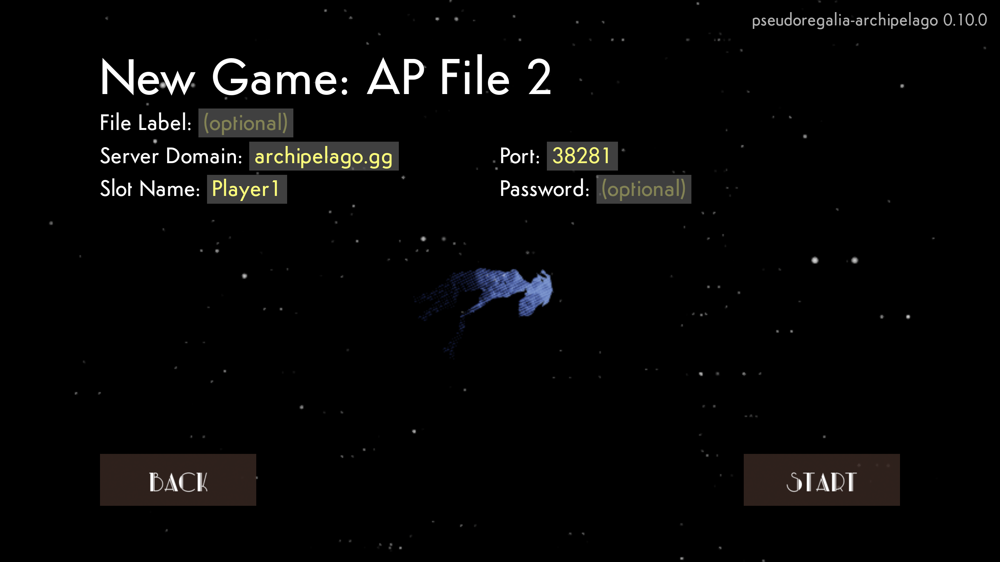

# pseudoregalia-archipelago
This is a mod for Pseudoregalia that works with the [multi-game multi-world randomizer Archipelago](https://archipelago.gg/). It is currently in alpha and is being actively developed. Abilities, minor upgrades, major keys, small keys, and health pieces are shuffled. Outfits are also shuffled if you are playing on current patch and the `randomize_time_trials` option is turned on.

You can get the latest release from [the releases page](https://github.com/qwint/pseudoregalia-archipelago/releases).

The logic is separated by difficulty, which you can choose in your player yaml file. The options are explained in the template.

There is an option to set or randomize your spawn point, and some spawns may start you with an item so you aren't immediately stuck. If you don't have Dream Breaker yet, you can save the game by touching a save point.

You can get the PopTracker pack for Pseudoregalia [here](https://github.com/highrow623/pseudoregalia_brooty).

# Extra Features
- If you ever get stuck, entering `/spawn` into the console will save your progress and take you back to where you spawned into the game.
- If you ever find yourself without Dream Breaker after obtaining it, entering `/breaker` into the console will recall it.
- You can toggle Solar Wind once you've obtained it by pressing the top face button on controller or left ctrl on keyboard.
- Entering `/popups mute` into the console will mute the sound effects of send/receive popups.
- Entering `/popups hide` into the console will stop send/receive popups from appearing completely.
- Client settings like death link are defined in `pseudoregalia/Binaries/Win64/Mods/AP_Randomizer/settings.toml`. Releases include a template file in the same folder called `settings.tmpl.toml` which explains what is configurable.

# Mod Installation
Note: If you are installing on Steam Deck, please read [the Steam Deck installation instructions](https://github.com/qwint/pseudoregalia-archipelago/blob/main/docs/steam_deck_installation.md) instead.
1. [Go to the Releases page](https://github.com/qwint/pseudoregalia-archipelago/releases/latest) and download the latest version of `pseudoregalia-archipelago.zip`.
2. In Steam/steamapps/common, make a copy of your Pseudoregalia folder and rename it "Pseudoregalia_AP" (or whatever else you like).
   * You can add the new `pseudoregalia.exe` as a "Non-Steam Game" in Steam to access it easily from Steam and to maintain Steam Input compatibility (which may be required for some controllers)
   * If you would like to play on full gold version, downpatch using the beta code `fullgoldjump` in Steam before copying the folder. You can make an AP folder for both versions if you want to be able to play on both.
3. Extract the contents of `pseudoregalia-archipelago.zip` directly into "Pseudoregalia_AP".

4. Create a shortcut to Pseudoregalia_AP/pseudoregalia.exe and rename it "Pseudoregalia_AP" (or whatever else you like). Place it on your desktop or in your games folder or whatever.
5. Launch the shortcut, which should open Pseudoregalia. Select a new file.
6. Enter the connect info and click Start.

# Generating a Seed
1. Install [Archipelago](https://archipelago.gg/tutorial/Archipelago/setup/en).
2. [Go to the Releases page](https://github.com/qwint/pseudoregalia-archipelago/releases/latest) and download the latest version of `pseudoregalia.apworld` and either double click to open the file with Archipelago, or manually place `pseudoregalia.apworld` into `Archipelago/custom_worlds` to install.
3. Place all yamls for the seed into Archipelago/Players.
   * You can get a template yaml file by clicking Generate Template Options after installing the apworld. If you just installed the apworld, you may have to restart the Archipelago Launcher before generating.
4. Run Generate from the Launcher.
5. A zip file will be added to Archipelago/output, which can [hosted on the website](https://archipelago.gg/uploads) or hosted locally by clicking Host.

# Compatibility

## Other Mods

`pseudoregalia-archipelago` touches many parts of the game in a way that might make it incompatible with other mods. (This is part of the reason why the installation guide recommends installing into a new folder.) Notably, it is NOT compatible with PseudoMenuMod because of the way they both modify the main menu. However, it does seem to be compatible with the Attire UI Overhaul Mod (custom outfits).

If you want to use other mods with this one, the safest thing to do is to install this mod first and add others one at a time, making sure they work as you go.

## Mod and APWorld

Starting in version `0.10.0`, the mod automatically checks the APWorld version used in generation to make sure it's compatible with the mod. Version `0.10.0` also introduced save management, so upgrading the mod might make it incompatible with existing saves. If you need to figure out which mod versions are compatible with a particular APWorld version, the rest of this section should give you the info you need.

In game, the mod version appears in the top right corner on the main menu. The APWorld version for an existing save file is shown on screen when the file is selected.

Version numbers are in the format `major.minor.patch` and a bump in each number has a different meaning:

* A major version bump (e.g. `1.3.2` to `2.0.0`) means a breaking change. This happens when changes are significant enough that the mod will not work with previous APWorld versions. In terms of compatibility, major versions must always match exactly.

  Major version `0` indicates a prerelease version. For example, version `0.10.0` is prerelease but version `1.0.0` is not.

* A minor version bump (e.g. `1.3.2` to `1.4.0`) means there is something new in the APWorld that requires an update in the mod. For non-prerelease versions, a mod is also compatible with an APWorld that has a lower minor version. For example, mod `1.3.2` is compatible with APWorlds `1.3.2` and `1.2.3`, but it isn't compatible with APWorld `1.4.0`.

  For prerelease versions, minor version bumps may also include breaking changes, so the minor version also has to match exactly. For example, mod `0.10.2` is compatible with APWorld `0.10.0`, but mod `0.11.0` is not.

* A patch version bump (e.g. `1.3.2` to `1.3.3`) means a change to either the mod or the APWorld that doesn't require updating the other. Examples include a bug fix in the mod or a small logic update in the APWorld. Patch versions don't matter for compatibility. All that matters is that the major and minor versions are compatible.

  Note: this means that the latest versions of the mod and the APWorld might be different. If the mod gets a patch update in release `1.3.1` but the APWorld is unchanged, that release will still have APWorld `1.3.0` to indicate that the APWorld is exactly the same as the previous release. The latest mod and APWorld will always be compatible with each other.

In summary:

* If a save file has APWorld version `a.b.c` where `a > 0`, only mod versions `a.y.z` where `y >= b` are compatible.
* If a save file has APWorld version `0.b.c` (i.e. is prerelease), only mod versions `0.b.z` are compatible.

# Known Issues
- The mod will not always fully load before starting the game, especially the first time. If the `pseudoregalia-archipelago [version]` text doesn't appear in the top right corner of the main menu, try restarting the game.
